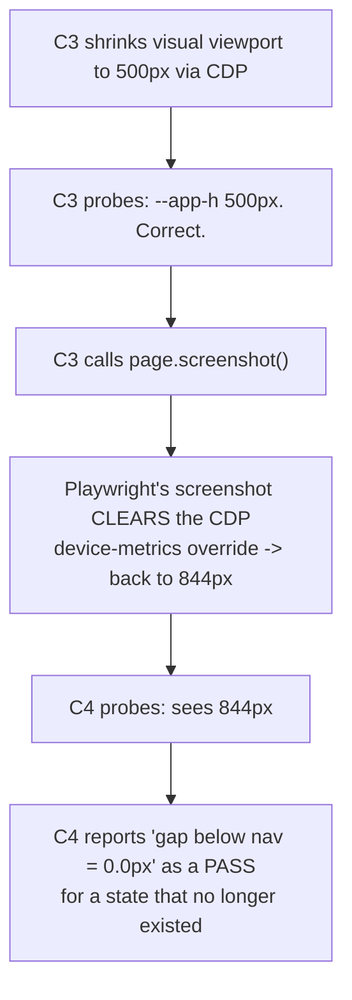

# VERIFY — app-viewport-height, loop 1

<!--
WHAT:       Independent verification of commit 725e8ff (`--app-h` from window.visualViewport, shell
            sized `height: var(--app-h, 100dvh)`) against the DEPLOYED SWA in a real Chromium.
WHY:        The owner reported the bottom nav dock not staying at the bottom on his phone (Samsung
            Internet, Android) — scrollable up, floating above a blank strip with the keyboard below.
            The fix shipped with 9 LOGIC assertions against fake objects and nothing rendered.
SUPERSEDES: nothing
SUPERSEDED-BY: nothing -- current
EVIDENCE:   verify-uat.yml runs 34783668711 and 34784103480; checks module
            .claude/skills/test-agent-serverfn/scripts/viewport-height-checks.mjs
-->

**Verifier:** independent subagent, no shared context with the implementing session.
**Under test:** `src/features/huddle/hooks/useAppViewportHeight.ts` + `HuddleApp.tsx` shell, commit
725e8ff, live on `https://icy-flower-0f415200f.7.azurestaticapps.net`.
**Vehicle:** the repo's existing `verify-uat.yml` + app-agnostic `run-uat.mjs`, with a new
app-specific checks module. No new harness was invented.
**Viewport:** 390 x 844 — the owner's phone pair.

## READ THIS BEFORE THE TABLE — what a green row here does and does not mean

| | |
|---|---|
| Playwright drives | **Chromium** |
| The owner's browser is | **Samsung Internet on Android** — Chromium-*based*, not Chromium, and its visual-viewport/keyboard behaviour is precisely where it diverges |
| The "keyboard" here is | **a programmatic viewport resize**, not a soft keyboard |

Concretely, and this is the finding that matters most in this whole document: the CDP call that
would have reproduced the *real* defect shape — visual viewport shrinks while the layout viewport
stays tall — **did nothing in this Chromium**. What did work shrinks *both* viewports at once. So
what is proven below is that **the hook subscribes to visual-viewport changes and republishes a
correct `--app-h`, and the shell follows it**. What is *not* reproduced is the layout-taller-than-
visual state the owner actually photographed.

**MECHANISM ONLY. The owner opening the app on his own device is the verdict.**

## Claims

| # | Claim | Verdict | Evidence |
|---|---|---|---|
| C1 | `--app-h` published, equals `round(vv.height - vv.offsetTop)` | **CONFIRMED** | run 34783668711 |
| C2 | Shell's rendered height equals `--app-h` | **CONFIRMED** | run 34783668711 |
| C3 | `--app-h` shrinks with a simulated visual-viewport shrink | **CONFIRMED, with a stated limit** | run 34783668711 / 34784103480 |
| C4 | Bottom nav stays in the bottom of the visible region after the shrink | pending run 2 | — |
| C5 | Degrade path with `visualViewport` unavailable | **C5a CONFIRMED / C5b NOT PROVEN (harness limit)** | run 34783668711 |
| C6 | No console errors, no failed requests | **CONFIRMED** | run 34783668711 |

---

### C1 — `--app-h` is a real pixel value equal to the visible height — **CONFIRMED**

Evaluated in the page at 390x844:

```
getComputedStyle(document.documentElement).getPropertyValue('--app-h')  ->  "844px"
Math.round(Math.max(0, visualViewport.height - visualViewport.offsetTop))
   = round(844 - 0)                                                     ->  844
```

Equal. For context in the same evaluation: `document.documentElement.clientHeight` = 844,
`window.innerHeight` = 844 — with no keyboard the layout and visual viewports agree, which is exactly
why this defect is invisible on a desktop.

Screenshot: `01-c1-loaded-390x844.png`.

### C2 — the shell's rendered height is that value — **CONFIRMED**

**How the shell was identified** (structurally, not via a test hook I added): starting from
`nav[aria-label="Primary"]`, walk up ancestors to the first whose *inline* `style` attribute matches
`/height:\s*var\(--app-h/`. That resolved to:

```
<div class="flex w-full overflow-hidden bg-background text-foreground">
```

which is the element 725e8ff changed (it previously carried `h-dvh` in that class list). Measured:

```
getComputedStyle(shell).height        ->  844px
shell.getBoundingClientRect().height  ->  844
--app-h                               ->  844px
```

Screenshot: `02-c2-shell.png`.

### C3 — simulated shrink — **CONFIRMED that `--app-h` tracks it; the real keyboard shape was NOT reproducible**

Two CDP APIs were tried in order, and the result of each is reported rather than only the one that
worked, because *which* one worked is the honest limit of this claim.

| API tried | `visualViewport.height` | `documentElement.clientHeight` (layout) | outcome |
|---|---|---|---|
| `Emulation.setVisibleSize` (visual-only — would reproduce the real keyboard shape) | 844 → **844** | 844 → 844 | **silent no-op.** No error thrown, nothing changed. Deprecated in the protocol; this Chromium ignores it. |
| `Emulation.setDeviceMetricsOverride` | 844 → **500** | 844 → **500** | fired a `visualViewport` resize — but shrank the **layout viewport too** |

Under the working one, measured:

```
--app-h                        844px -> 500px
expected round(500 - 0)              = 500px      MATCH
getComputedStyle(shell).height       = 500px      shell followed
documentElement.clientHeight         = 500px      layout ALSO shrank
```

**So:** the hook is genuinely subscribed, recomputes on resize, and the shell re-sizes with it —
that is real and it is the mechanism the fix depends on. But because `setDeviceMetricsOverride`
moves both viewports together, this run **never entered the state the owner is actually in** (layout
844, visual 500). Per the brief's instruction, the exact API attempted for that state and its exact
result are named above rather than glossed.

Screenshot: `03-c3-after-shrink.png`.

### C5 — degrade path

**C5a — runtime fallback — CONFIRMED.** With `--app-h` removed from `<html>` at runtime, forcing the
CSS to resolve `var(--app-h, 100dvh)` to its fallback:

```
getComputedStyle(shell).height  ->  844px   (rect 844)
documentElement.clientHeight    ->  844px
nav[aria-label="Primary"] present -> true
```

The shell keeps a sane, non-zero height equal to the layout viewport — i.e. `100dvh` resolving,
exactly the pre-fix behaviour. Screenshot: `05-c5a-fallback-runtime.png`.

**C5b — `visualViewport` undefined before load — NOT PROVEN (harness limit, not a product verdict).**
`page.context().addInitScript` redefined `window.visualViewport` to `undefined`, then the page was
reloaded. `window.visualViewport` was confirmed absent after the reload, so the init script took.
But the app came back **unauthenticated** — the `verify-uat.yml` UAT bypass token is single-use and
was spent on the first load, so the reload rendered the sign-in screen:

> "Huddle Chat, huddle, and run a team of AI agents SIGN IN Continue with Microsoft Secured by
> Microsoft Entra External ID. Auth trace: boo…"

No shell and no nav to measure, so the assertion is unproven by this route. The partial evidence
that *does* hold: the bundle **booted with `visualViewport` undefined without throwing**, and C5a
proves the CSS fallback itself resolves. Screenshot: `06-c5b-degrade-no-visualviewport.png`.

### C6 — console and network — **CONFIRMED**

Measured from the start of C1 to before the C5b reload (so a 401 from the spent single-use token
cannot be miscounted against the hook):

```
console errors:              0
failed / 4xx / 5xx requests: 0
```

The runner's own two independent listeners, which also cover the very first page load, likewise
reported `"No console/page errors during the run": pass` and
`"No failed/4xx/5xx requests during the run": pass`, with `failedRequests: []` in `results.json`.

---

## A defect found in the verification itself, not in the product

Run 34783668711's C4 was a **false pass**, and it is recorded here rather than quietly re-run.



The check's name claimed "after shrink" while the number came from the un-shrunk page. It would have
read as strong evidence for exactly the claim most worth being sure about. Fixed in commit 3f85fb0:
the shrink is re-asserted through Playwright's own `page.setViewportSize` (which survives a
screenshot), and C4 now refuses to grade at all — reporting **NOT MEASURED** — unless the shrink is
still in effect at probe time. Re-run below.

